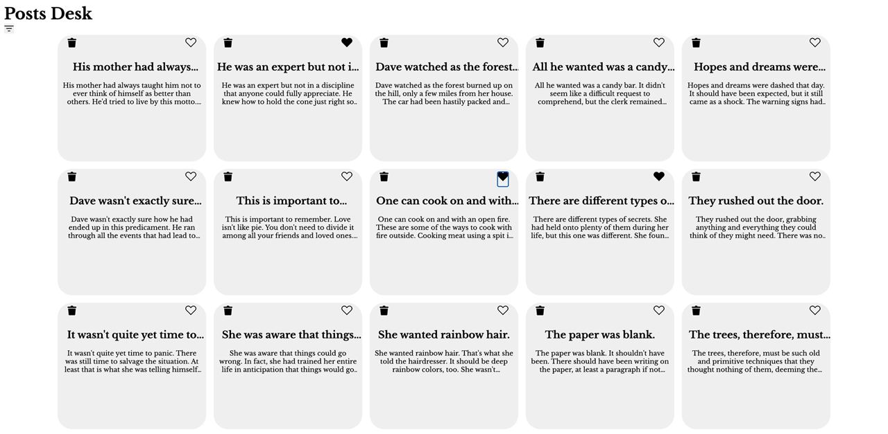

Проект: Галерея постов

https://alexandrabochenina.github.io/post-gallery/

Основные технологии: 

* Данные для карточек получаем с публичного API
* Данные хронятся в store, реализован slice для удобного использования данных
* На карточке добавлены кнопки "нравится" и "удалить"
* При нажатии на карточку будет открыт popup с полной информацией карточки 
* В левом верхнем углу есть кнопка фильтр, при нажатии на которую будут показаны только те посты, на которых стоит "нравится"
